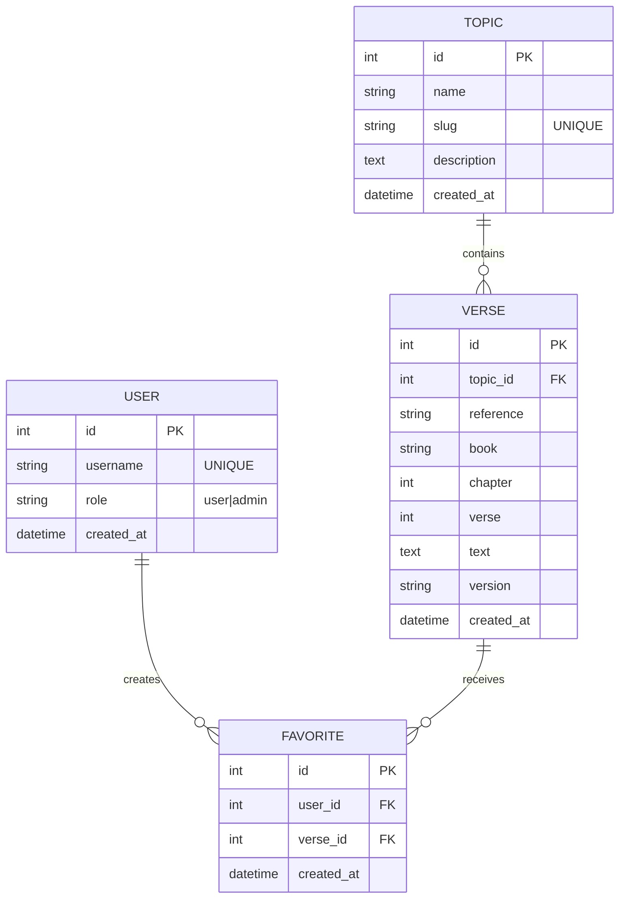

# Mini-Project 3

## Project Overview

This project is a backend API that provides topical Bible verses based on curated themes such as life events or emotional states. The application integrates with an external Bible API, stores the data in a MySQL database, and exposes REST endpoints for interacting with the data. All functionality is demonstrated using API tools such as Hoppscotch.

### External Data Source: Bible API

This project integrates with the **Bible API** by wldeh, a free and publicly accessible REST API that provides Bible verses and chapters in JSON format. (https://github.com/wldeh/bible-api)

- No API key or authentication is required
- Supports multiple Bible versions (e.g., ASV, KJV)
- Provides verse-level and chapter-level access
- Serves public-domain Bible translations

The Bible API is used during the application startup process to fetch specific verses based on predefined topics. These verses are then stored locally in the MySQL database so the application does not rely on the external API for every request.

To obtain a specific verse, send a request to the following endpoint:
`https://cdn.jsdelivr.net/gh/wldeh/bible-api/bibles/${version}/books/${book}/chapters/${chapter}/verses/${verse}.json`
Replace ${version}, ${book}, ${chapter}, and ${verse} with the appropriate values.

Example: Fetch John 3:16 in the King James Version (KJV):
`https://cdn.jsdelivr.net/gh/wldeh/bible-api/bibles/en-kjv/books/john/chapters/3/verses/16.json`

### Core Functionality

- Fetch Bible verses from an external Bible API during application startup
- Populate and persist topics and verses in a MySQL database
- Provide REST API endpoints for retrieving topics and verses
- Allow users to save favorite topics or verses
- Track user interaction history (e.g., viewed topics or verses)
- Support full CRUD (Create, Read, Update, Delete) operations on core resources

### User Capabilities

Users of the system can:

- Create or select a user session
- View a list of available topics
- Retrieve verses associated with a topic
- Save (favorite) topics or verses and access them.

### Application Architecture (Visual Layout)

The application is structured as two backend services:

- **Content Service (Port 3001)**
  - Manages topics and verses
  - Integrates with the external Bible API
  - Handles content-related database operations

- **User Service (Port 3002)**
  - Manages users and favorites
  - Handles user-specific data and interactions

All interaction with the system is performed through REST API requests using Hoppscotch.

---

## Logical Model

### Entities
- User  
- Topic  
- Verse  
- Favorite    

### Relationships
- A **Topic** can reference **many Verses**, but each **Verse** belongs to **one Topic**.
- A **User** can create **many Favorites**, but each **Favorite** is created by **one User**.
- A **Verse** can receive **many Favorites**, but each **Favorite** references **one Verse**.
- A **User** can favorite **many Verses**, and a **Verse** can be favorited by **many Users**.  
  This many-to-many relationship is implemented using the **Favorite** entity.

### Relationship Summary
- TOPIC 1:M VERSE (contains)
- USER 1:M FAVORITE (creates)
- VERSE 1:M FAVORITE (receives)
- USER M:N VERSE (favorites) via FAVORITE

## Physical Model 



## MySQL

### Step 1: Create the Database

1. Open **MySQL Workbench**
2. Connect to your local MySQL instance
3. Open a new query tab
4. Run the following commands:

```sql
CREATE DATABASE verse_index_sql;
USE verse_index_sql;
```
Verify with the command `SELECT DATABASE();`  
The output should be "verse_index_sql"

### Step 2: Create the `users` Table
This is created first because it does not depend on any other tables.
```sql
CREATE TABLE users (
    id INT AUTO_INCREMENT PRIMARY KEY,
    username VARCHAR(50) NOT NULL UNIQUE, -- username up to 50 characters, required, and unique to each user
    role VARCHAR(10) NOT NULL DEFAULT 'user', -- required, 10 character text field, becomes user by default
    created_at DATETIME NOT NULL DEFAULT CURRENT_TIMESTAMP -- stores date and time, required, and automatically set when inserted
);
```
Verify the table structure and constraints with the command `SHOW INDEX FROM users;`
It should return two indexes: 
-PRIMARY index on `id`
-UNIQUE index on `username`

### Step 3: Create the `topics` Table

The `topics` table represents curated thematic categories such as *sadness*, *justice*, or *parenting*. Each topic can be associated with multiple Bible verses. This table is created before the `verses` table because it is a parent entity that other tables will reference via foreign keys.

```sql
CREATE TABLE topics (
    id INT AUTO_INCREMENT,              -- Primary key, auto-generated unique ID for each topic
    name VARCHAR(100) NOT NULL,          -- Topic name (e.g., "Confidence")
    slug VARCHAR(100) NOT NULL UNIQUE,   -- URL-safe unique identifier (e.g., "confidence")
    description TEXT,                   -- Optional longer description of the topic
    created_at DATETIME NOT NULL 
        DEFAULT CURRENT_TIMESTAMP,       -- Timestamp for when the topic was created
    PRIMARY KEY (id)                     -- Defines `id` as the primary key
);
``` 

Verify the table was created with the command `SHOW TABLES;`

The output should include:
- users
- topics

Then verify running `DESCRIBE topics;`

Confirm that:
- id is the primary key
- slug is marked as UNIQUE
- created_at has a default timestamp

After running `SHOW INDEX FROM topics;`

It should return:
- A PRIMARY index on id
- A UNIQUE index on slug