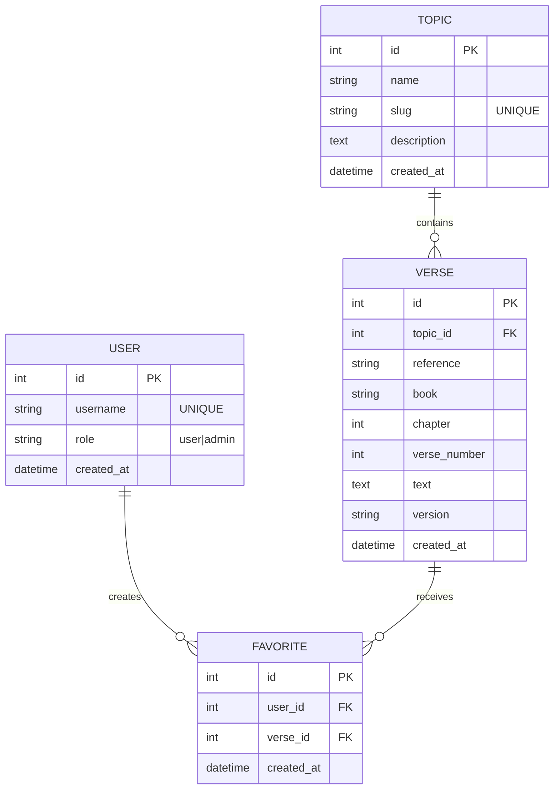

# Verse Index

## Project Overview

This project is a backend API that provides topical Bible verses based on curated themes such as life events or emotional states. The application integrates with an external Bible API, stores the data in a MySQL database, and exposes REST endpoints for interacting with the data. All functionality is demonstrated using API tools such as Hoppscotch.

### External Data Source: Bible API

This project integrates with the **Bible API** by wldeh, a free and publicly accessible REST API that provides Bible verses and chapters in JSON format. [View Bible API Repository](https://github.com/wldeh/bible-api)

- No API key or authentication is required
- Supports multiple Bible versions (e.g., ASV, KJV)
- Provides verse-level and chapter-level access
- Serves public-domain Bible translations

The Bible API is used during the application startup process to fetch specific verses based on predefined topics. These verses are then stored locally in the MySQL database so the application does not rely on the external API for every request.

To obtain a specific verse, send a request to the following endpoint:
`https://cdn.jsdelivr.net/gh/wldeh/bible-api/bibles/${version}/books/${book}/chapters/${chapter}/verses/${verse}.json`
Replace ${version}, ${book}, ${chapter}, and ${verse} with the appropriate values.

Example: Fetch John 3:16 in the King James Version (KJV):
`https://cdn.jsdelivr.net/gh/wldeh/bible-api/bibles/en-kjv/books/john/chapters/3/verses/16.json`

### Core Functionality

- Fetch Bible verses from an external Bible API during application startup
- Populate and persist topics and verses in a MySQL database
- Provide REST API endpoints for retrieving topics and verses
- Allow users to save favorite verses
- Support full CRUD (Create, Read, Update, Delete) operations on core resources

### User Capabilities

Users of the system can:

- Create or select a user session
- View a list of available topics
- Retrieve verses associated with a topic
- Save (favorite) topics or verses and access them.

### Application Architecture
This application is a single Express-based REST API built using the MVC pattern.

- **Server Layer**
  - Express.js server
  - Sequelize ORM for MySQL
  - Environment-based configuration using dotenv

- **Model Layer**
  - MySQL tables managed through Sequelize models
  - Topics, Verses, Users, Favorites

- **Controller Layer**
  - Handles request logic for topics, verses, users, and favorites
  - Fetches external Bible data during startup seeding

- **Routes Layer**
  - RESTful endpoints consumed via Hoppscotch

The application integrates an external Bible API to populate verse data, which is then persisted locally in MySQL.

---
### Data Flow Overview

1. On server startup, the application:
   - Reads predefined topics and verse references
   - Fetches verse text from the external Bible API
   - Stores verses in the MySQL database

2. Clients (via Hoppscotch) request data through REST endpoints.

3. The API serves data directly from MySQL without repeatedly calling the external API.

### API Routes
The application exposes RESTful endpoints that allow clients to retrieve topics, verses, and manage user favorites. All endpoints are tested using **Hoppscotch**.

### Topics
- `GET /api/topics`
  - Returns a list of all available topics.

### Verses
- `GET /api/verses`
  - Returns all verses stored in the database.
- `GET /api/verses/topic/:topicId`
  - Returns all verses associated with a specific topic.

### Favorites
- `POST /api/favorites`
  - Saves a verse as a favorite for a user.
- `GET /api/favorites/:userId`
  - Retrieves all favorited verses for a user.

CRUD operations are demonstrated through these endpoints and verified via Hoppscotch.


## Logical Model

### Entities
- User  
- Topic  
- Verse  
- Favorite    

### Relationships
- A **Topic** can reference **many Verses**, but each **Verse** belongs to **one Topic**.
- A **User** can create **many Favorites**, but each **Favorite** is created by **one User**.
- A **Verse** can receive **many Favorites**, but each **Favorite** references **one Verse**.
- A **User** can favorite **many Verses**, and a **Verse** can be favorited by **many Users**.  
  This many-to-many relationship is implemented using the **Favorite** entity.

### Relationship Summary
- TOPIC 1:M VERSE (contains)
- USER 1:M FAVORITE (creates)
- VERSE 1:M FAVORITE (receives)
- USER M:N VERSE (favorites) via FAVORITE

## Physical Model 




## Tech Stack

- **Node.js**
- **Express.js**
- **MySQL**
- **Sequelize**
- **dotenv**
- **Axios / Fetch for external API integration**
- **Hoppscotch for API testing**

## Feedback

Strengths highlighted in feedback included:

- comprehensive documentation and planning
- strong relational database design
- clear data flow from external API to local database
- professional Mermaid ER diagram
- clean MVC architecture
- modular service-based approach to API fetching
- robust error handling and readable code
- proper use of Sequelize associations and constraints
- smart startup seeding strategy that avoids repeated external API dependency

The project was recognized as a strong backend implementation with thoughtful engineering decisions, clean organization, and realistic database design.

## Work In Progress

The following are the main next-step improvements for the project:

- add missing Update operations for topics, verses, or users
- fix `package.json` so the `main` field points to `server.js`
- add an `npm start` script
- add request validation using a library such as Joi or express-validator
- generate API documentation with Swagger/OpenAPI
- add Jest tests for controllers and services
- implement structured logging
- add authentication with JWT
- expand the number of supported topics
- split the system into separate content-service and user-service layers

## Reflection

This project strengthened my understanding of:

- building REST APIs with Express and Sequelize
- designing relational schemas before implementation
- modeling many-to-many relationships with junction tables
- using startup seeding to convert external API data into internal application data
- organizing backend code using MVC principles
- thinking about database integrity, scalability, and maintainability together

It also gave me more practice presenting backend architecture clearly and explaining the reasoning behind technical decisions.

## Repository Notes

This public repository is a portfolio version of the project and preserves the development history of the original work.

## Setup Instructions

1. Clone the repository
2. Install dependencies
3. Create a `.env` file with your MySQL credentials
4. Create the `verse_index_sql` database in MySQL as detailed below
5. Run the server and allow the startup seed process to populate the database
6. Test endpoints using Hoppscotch or Postman


## MySQL Setup Details

### Step 1: Create the Database

1. Open **MySQL Workbench**
2. Connect to your local MySQL instance
3. Open a new query tab
4. Run the following commands:

```sql
CREATE DATABASE verse_index_sql;
USE verse_index_sql;
```
Verify with the command `SELECT DATABASE();`  
The output should be "verse_index_sql"

### Step 2: Create the `users` Table
This is created first because it does not depend on any other tables.
```sql
CREATE TABLE users (
    id INT AUTO_INCREMENT PRIMARY KEY,
    username VARCHAR(50) NOT NULL UNIQUE, -- username up to 50 characters, required, and unique to each user
    role VARCHAR(10) NOT NULL DEFAULT 'user', -- required, 10 character text field, becomes user by default
    created_at DATETIME NOT NULL DEFAULT CURRENT_TIMESTAMP -- stores date and time, required, and automatically set when inserted
);
```
Verify the table structure and constraints with the command `SHOW INDEX FROM users;`
It should return two indexes: 
-PRIMARY index on `id`
-UNIQUE index on `username`

### Step 3: Create the `topics` Table

The `topics` table represents curated thematic categories such as *sadness*, *justice*, or *parenting*. Each topic can be associated with multiple Bible verses. This table is created before the `verses` table because it is a parent entity that other tables will reference via foreign keys.

```sql
CREATE TABLE topics (
    id INT AUTO_INCREMENT, -- Primary key, auto-generated unique ID for each topic
    name VARCHAR(100) NOT NULL, -- Topic name (e.g., "Confidence")
    slug VARCHAR(100) NOT NULL UNIQUE,-- URL-safe unique identifier (e.g., "confidence")
    description TEXT,-- Optional longer description of the topic
    created_at DATETIME NOT NULL 
        DEFAULT CURRENT_TIMESTAMP,-- Timestamp for when the topic was created
    PRIMARY KEY (id) -- Defines `id` as the primary key
);
``` 

Verify the table was created with the command `SHOW TABLES;`

The output should include:
- users
- topics

Then verify running `DESCRIBE topics;`

Confirm that:
- id is the primary key
- slug is marked as UNIQUE
- created_at has a default timestamp

After running `SHOW INDEX FROM topics;`

It should return:
- A PRIMARY index on id
- A UNIQUE index on slug

###  Step 4: Create the `verses` Table
The `verses` table stores individual Bible verses fetched from the external Bible API and saved locally. Each verse belongs to exactly one topic, so this table contains a foreign key: `topic_id` → `topics.id`

```sql

CREATE TABLE verses (
    id INT AUTO_INCREMENT,-- Primary key, auto-generated unique ID for each verse
    topic_id INT NOT NULL,-- Foreign key linking the verse to a topic
    reference VARCHAR(50) NOT NULL,-- Full reference string (e.g., "John 3:16")
    book VARCHAR(50) NOT NULL,-- Book name (e.g., "john")
    chapter INT NOT NULL,-- Chapter number
    verse_number INT NOT NULL,-- Verse number
    text TEXT NOT NULL,-- Verse text content
    version VARCHAR(20) NOT NULL,-- Bible version (e.g., "en-kjv")
    created_at DATETIME NOT NULL DEFAULT CURRENT_TIMESTAMP,-- Timestamp for when the verse row was created
    PRIMARY KEY (id),-- Defines `id` as the primary key
    FOREIGN KEY (topic_id) REFERENCES topics(id) ON DELETE CASCADE -- Enforces Topic 1:M Verse; deletes verses if topic is deleted
);
``` 

In the Workbench GUI verify the `verses` table was created correctly.

1. In the **Schemas** panel, expand:
   - `verse_index_sql`
   - `Tables`

2. Confirm that the following tables are listed:
   - `topics`
   - `users`
   - `verses`

3. Expand the `verses` table and confirm the **Columns** section includes:
     - `id`
     - `topic_id`
     - `reference`
     - `book`
     - `chapter`
     - `verse_number`
     - `text`
     - `version`
     - `created_at`

4. Expand **Indexes** under `verses` and confirm:
   - A **PRIMARY** index exists on `id`

5. Expand **Foreign Keys** under `verses` and confirm:
   - A foreign key exists linking:
     - `verses.topic_id → topics.id`
   - `ON DELETE` is set to **CASCADE**

If all items above are visible in the schema browser, the `verses` table has been created and linked correctly.

### Step 5: Create the `favorites` Table 
This junction table represents a many-to-many relationship between `users` and `verses`. One user can favorite many verses. One verse can be favorited by many users. 

The biggest requirement here is preventing duplicates --a user can only favorite the same verse once-- by adding a composite UNIQUE constraint of `(user_id, verse_id)`.


```sql
CREATE TABLE favorites (
    id INT AUTO_INCREMENT,-- Primary key, auto-generated unique ID for each favorite row
    user_id INT NOT NULL,-- Foreign key to users.id
    verse_id INT NOT NULL,-- Foreign key to verses.id
    created_at DATETIME NOT NULL DEFAULT CURRENT_TIMESTAMP, -- Timestamp for when it was favorited
    PRIMARY KEY (id),-- Defines `id` as the primary key
    UNIQUE KEY unique_user_verse (user_id, verse_id), -- Prevent duplicates: a user can only favorite a specific verse once
    FOREIGN KEY (user_id) REFERENCES users(id) ON DELETE CASCADE,
    FOREIGN KEY (verse_id) REFERENCES verses(id) ON DELETE CASCADE
);
```

In the **Schemas** panel → expand `verse_index_sql` → `Tables`

Confirm the following tables exist:
- `users`
- `topics`
- `verses`
- `favorites`

Expand `favorites` and verify:

**Columns**
- `id`
- `user_id`
- `verse_id`
- `created_at`

**Indexes**
- `PRIMARY` (on `id`)
- `unique_user_verse` (UNIQUE on `user_id`, `verse_id`) — prevents duplicate favorites

**Foreign Keys**
- `favorites.user_id → users.id` (ON DELETE CASCADE)
- `favorites.verse_id → verses.id` (ON DELETE CASCADE)

### Step 6: Seed Test Data
This step verifies that the database schema, foreign keys, and constraints function correctly by inserting a small set of test data.  

For this test, the following data is used:

- User: `leilani`
- Topic: `stressed`
- Verses:
  - Exodus 18:13–26
  - Matthew 11:28–30
  - Mark 6:31–32

#### 6.1 Insert a User

```sql
INSERT INTO users (username, role)
VALUES ('leilani', 'user');
```

#### 6.2 Insert a Topic

```sql
INSERT INTO topics (name, slug, description) VALUES 
('Stressed', 'stressed', 'Verses for when you feel stressed or overwhelmed.');
```

#### 6.3 Insert Verses for the Topic
First, we get the topic id:
```sql
SELECT id FROM topics WHERE slug = 'stressed';
```
Use that `id` value as `topic_id` in the inserts below.

In the final implementation, verse text is **not manually inserted**.  
Instead, verses are fetched from the external Bible API during application startup and automatically persisted to the database.

The SQL below is provided only as a **conceptual example** to demonstrate the table structure and foreign key relationships.


```sql
INSERT INTO verses (topic_id, reference, book, chapter, verse_number, text, version) VALUES
(1, 'Exodus 18:13-26', 'exodus', 18, 13, '[PLACEHOLDER TEXT]', 'en-kjv'),
(1, 'Matthew 11:28-30', 'matthew', 11, 28, '[PLACEHOLDER TEXT]', 'en-kjv'),
(1, 'Mark 6:31-32', 'mark', 6, 31, '[PLACEHOLDER TEXT]', 'en-kjv');
```

#### 6.4 Favorite a Verse
First, get the user id and a verse id:
```sql
SELECT id FROM users WHERE username = 'leilani';
SELECT id, reference FROM verses WHERE topic_id = 1;
```
Insert a favorite record linking user `leilani` to one of the verses.
```sql
INSERT INTO favorites (user_id, verse_id)
VALUES (1, 1);
```

#### 6.5 Attempt a Duplicate Favorite 
Try to insert the **same user–verse favorite combination again**.
```sql
INSERT INTO favorites (user_id, verse_id)
VALUES (1, 1);
```
This should fail.

#### 6.6 Final Verification
Confirm the verses are linked to the topic:
```sql
SELECT topics.slug, verses.reference
FROM verses
JOIN topics ON verses.topic_id = topics.id
WHERE topics.slug = 'stressed';
```
Confirm `leilani` has a favorite saved:
```sql
SELECT users.username, verses.reference
FROM favorites
JOIN users ON favorites.user_id = users.id
JOIN verses ON favorites.verse_id = verses.id
WHERE users.username = 'leilani';
```
